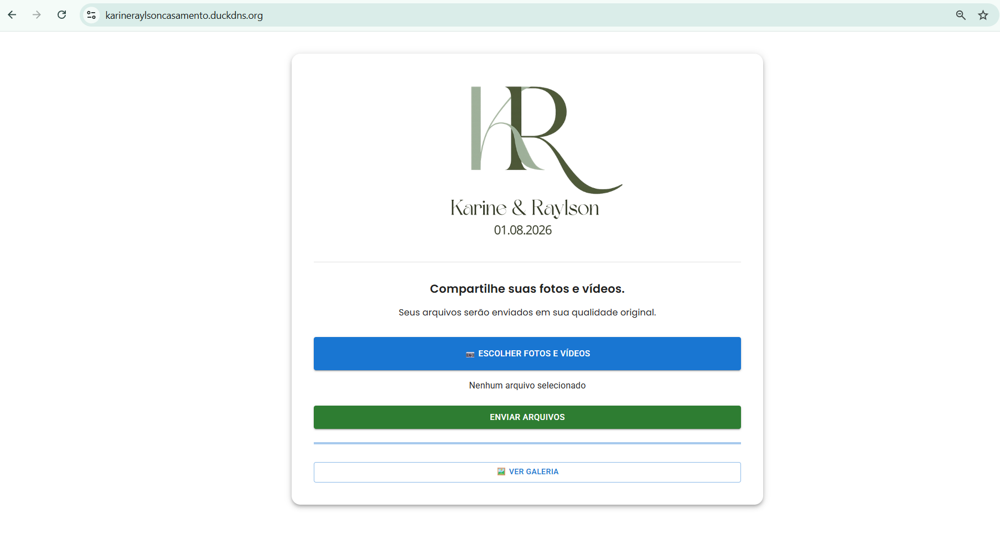
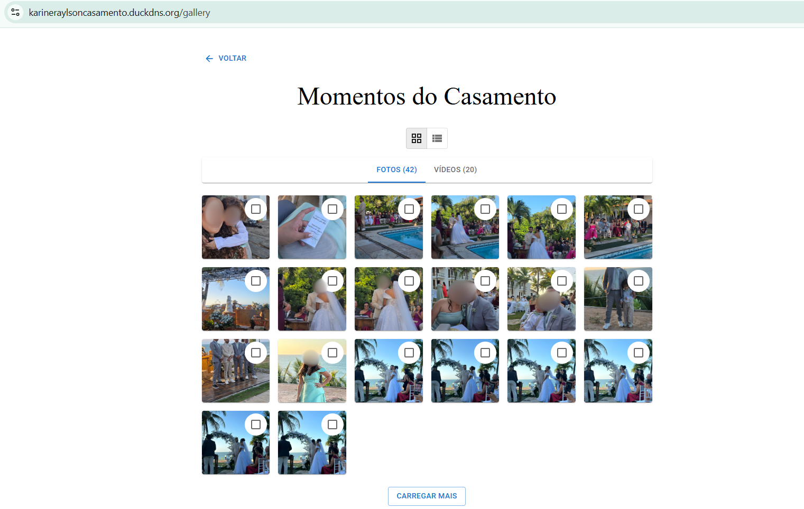
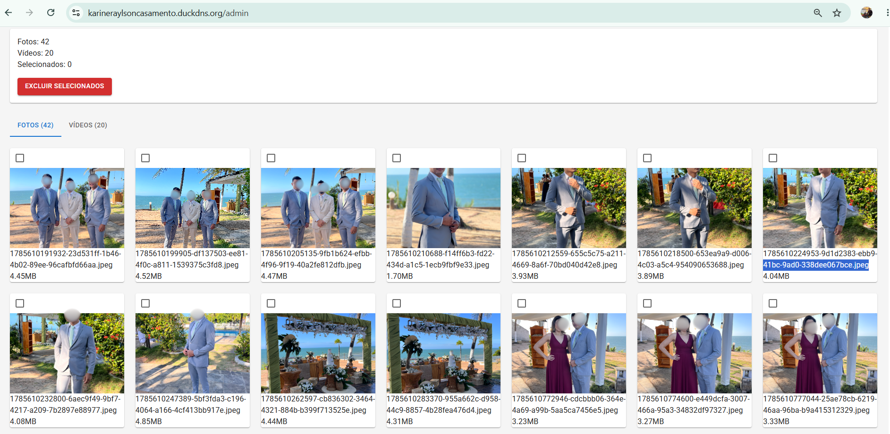

# RK Storage

**Sistema web para compartilhamento de fotos e vídeos em eventos.**

O RK Storage permite que convidados enviem fotos e vídeos diretamente pelo celular para uma galeria compartilhada, mantendo os arquivos em sua qualidade original.

---

## Screenshots

### Tela Inicial



### Galeria



### Painel Administrador



---

## Sobre o projeto

O RK Storage foi desenvolvido para atender a uma necessidade real: permitir que diversos convidados de um evento compartilhem fotos e vídeos utilizando seus próprios celulares.

O sistema foi utilizado em um evento real, com múltiplos usuários enviando arquivos simultaneamente para um servidor hospedado em uma VPS.

A aplicação foi desenvolvida considerando:

* Arquivos em qualidade original
* Upload de fotos e vídeos
* Upload de múltiplos arquivos
* Acesso por dispositivos móveis
* Galeria compartilhada
* Atualização automática da galeria
* Visualização de fotos e vídeos
* Download dos arquivos
* API REST
* Armazenamento no servidor

---

## Tecnologias utilizadas

### Frontend

* React
* Vite
* JavaScript
* Axios

### Backend

* Node.js
* Express
* Multer
* REST API

### Infraestrutura

* Ubuntu Linux
* Nginx
* VPS
* PM2

---

## Arquitetura

```text
                    ┌─────────────────────┐
                    │      Usuário        │
                    │  Celular / Desktop  │
                    └──────────┬──────────┘
                               │
                               ▼
                    ┌─────────────────────┐
                    │      Frontend       │
                    │   React + Vite      │
                    └──────────┬──────────┘
                               │
                               ▼
                    ┌─────────────────────┐
                    │       Nginx         │
                    │  Reverse Proxy/Web  │
                    └──────────┬──────────┘
                               │
                               ▼
                    ┌─────────────────────┐
                    │       Backend       │
                    │  Node.js + Express  │
                    └──────────┬──────────┘
                               │
                               ▼
                    ┌─────────────────────┐
                    │      Multer         │
                    │ Upload de arquivos  │
                    └──────────┬──────────┘
                               │
                               ▼
                    ┌─────────────────────┐
                    │     Armazenamento   │
                    │       na VPS        │
                    └─────────────────────┘
```

---

## Funcionalidades

### Upload

Permite o envio de fotos e vídeos através do navegador, incluindo múltiplos arquivos em uma única operação.

### Galeria

Os arquivos enviados ficam disponíveis em uma galeria compartilhada.

A galeria realiza consultas periódicas à API para identificar novos arquivos.

### Visualização

Fotos e vídeos podem ser visualizados diretamente pela aplicação.

### Download

Os arquivos disponíveis na galeria podem ser selecionados e baixados pelo usuário.

### Compatibilidade

A aplicação foi desenvolvida para funcionar em dispositivos móveis e computadores.

---

## API

### Listar arquivos

```http
GET /files
```

Retorna a lista de arquivos disponíveis na galeria.

### Enviar arquivos

```http
POST /upload
```

Realiza o upload de fotos e vídeos para o servidor.

---

## Tipos de arquivos aceitos

### Imagens

* JPG
* JPEG
* PNG
* WEBP
* HEIC

### Vídeos

* MP4
* MOV
* AVI
* MKV
* WEBM

---

## Estrutura do projeto

```text
rk-storage/
│
├── backend/
│   ├── src/
│   │   ├── controllers/
│   │   ├── middleware/
│   │   ├── routes/
│   │   └── server.js
│   │
│   └── package.json
│
├── frontend/
│   ├── src/
│   │   ├── components/
│   │   ├── pages/
│   │   └── services/
│   │
│   └── package.json
│
├── documentacao/
│
├── screenshots/
│   ├── galeria.png
│   ├── upload.png
│   └── visualizacao.png
│
├── .gitignore
└── README.md
```

---

## Infraestrutura e Deploy

O sistema foi hospedado em uma VPS utilizando Ubuntu Linux.

O Nginx é responsável pela disponibilização do frontend e pelo encaminhamento das requisições da API para o backend.

O backend Node.js é executado utilizando PM2, garantindo que a aplicação permaneça em execução no servidor.

```text
Internet
   │
   ▼
Nginx
   │
   ├── Frontend React
   │
   └── API
        │
        ▼
     Node.js
        │
        ▼
   Armazenamento
```

---

## Objetivo

O projeto foi desenvolvido como uma aplicação prática para trabalhar conceitos de:

* Desenvolvimento web
* React
* Node.js
* APIs REST
* Upload de arquivos
* Manipulação de arquivos
* Desenvolvimento frontend e backend
* Linux
* Nginx
* Deploy em VPS
* Gerenciamento de processos com PM2
* Testes automatizados

Além do desenvolvimento, o projeto também serviu como experiência prática para aplicação de conceitos de **Qualidade de Software e QA**.

---

## Status

**Projeto funcional e utilizado em um evento real.**

Próximas melhorias planejadas:

* Implementação de testes automatizados
* Ampliação da cobertura de testes da API
* Melhorias na validação de arquivos
* Evolução da experiência do usuário

---

## Autor

**Lucas Santos**

Desenvolvedor em formação, com foco em **Desenvolvimento Web e Qualidade de Software**.

---

## Licença

Este projeto foi desenvolvido para fins de estudo, portfólio e demonstração técnica.
